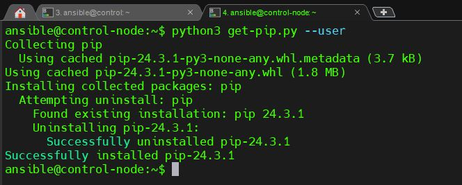
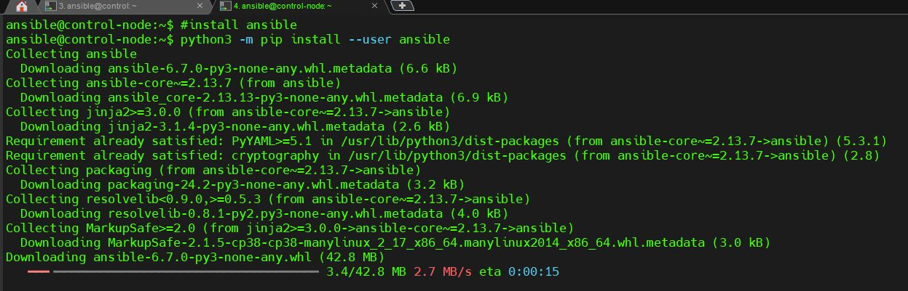
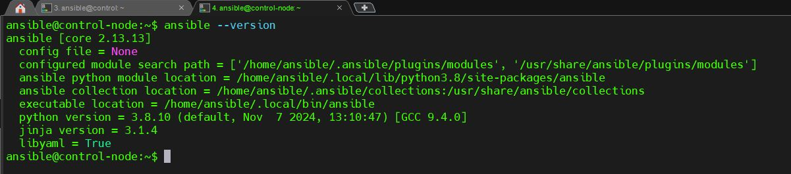
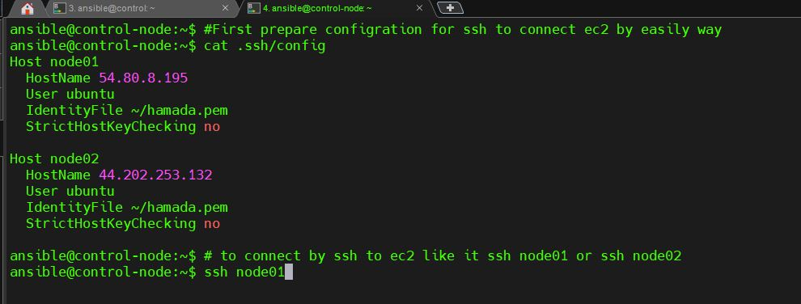
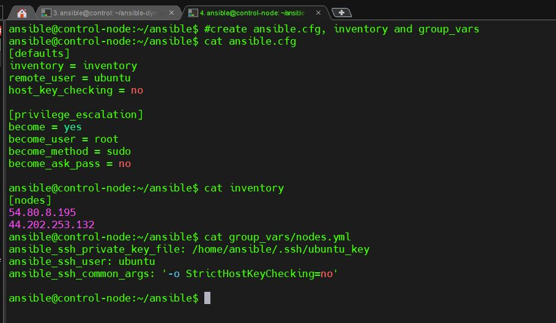
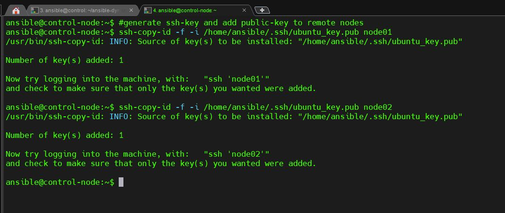
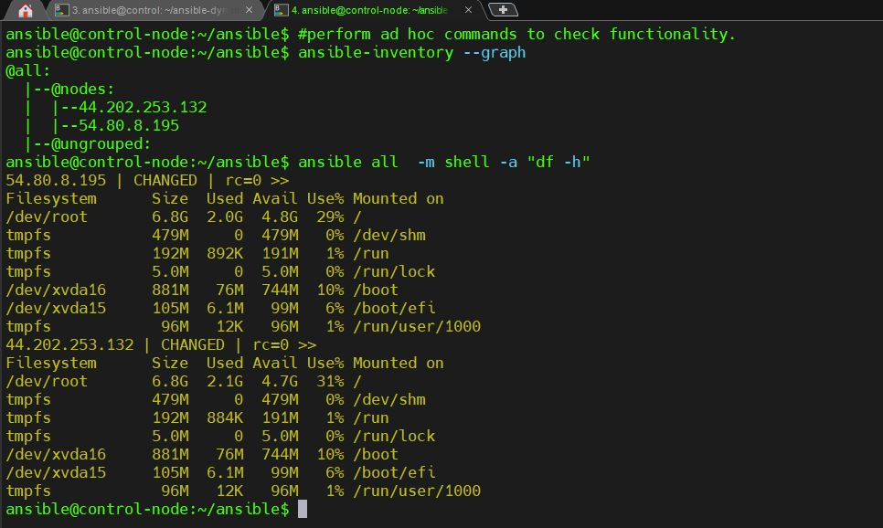

# Ansible Installation and Configuration

## Objective
This document outlines the steps to:
1. Install and configure the **Ansible Automation Platform** on control nodes.
2. Create inventories of managed hosts.
3. Perform ad hoc commands to verify functionality.

---

## Prerequisites
- A control node running a supported Linux distribution (e.g., Ubuntu, CentOS, or Amazon Linux).
- Managed nodes with SSH access configured.
- Internet access for downloading Ansible dependencies.

---

## Steps

### 1. Install Ansible on the Control Node
#### For Ubuntu-based systems:
1. **Update the package list**:
    ```bash
    sudo apt update
    ```
2. **Install Ansible Using pip  **:
    ```bash
    curl https://bootstrap.pypa.io/get-pip.py -o get-pip.py
    python3 get-pip.py --user
    python3 -m pip install --user ansible
    ```
	
	

3. **Verify the installation**:
    ```bash
    ansible --version
    ```
     

#### Configration SSH Because ansible based on SSH:
1. **Create and add cofiguration in this file .ssh/config  **:
    

2. **Create ansible.cfg, inventory and group_vars**:
    

3. **Copy public-key to remote nodes**:
    ```bash
    ssh-copy-id -f -i ~/.ssh/ubuntu_key.pub node01
    ssh-copy-id -f -i ~/.ssh/ubuntu_key.pub node02
    ```
    

---

### 2. Perform Ad Hoc Commands
1. **Ping all hosts to verify connectivity**:
    ```bash
    ansible all -m ping
    ```
2. **Gather system information for all managed hosts**:
    ```bash
    ansible all -m setup
    ```
3. **Run a shell command on a specific group**:
    Example: Check disk space on web servers:
    ```bash
    ansible webservers -a "df -h"
    ```
    
---

### 3. Common Issues and Troubleshooting
- **Permission Denied**: Ensure SSH keys are correctly configured, and the control node has access to managed nodes.
- **Ansible Not Found**: Ensure Ansible is installed and added to the system's PATH.

---

## Conclusion
With these steps, you should have Ansible installed and configured, and be able to manage nodes and execute ad hoc commands successfully.

---

## Resources
- [Ansible Documentation](https://docs.ansible.com/)
- [Ansible GitHub Repository](https://github.com/ansible/ansible)

