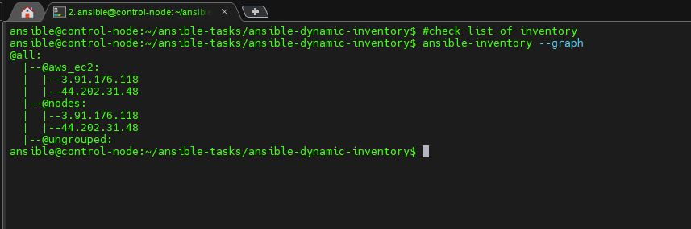

# Ansible Dynamic Inventories and Apache Installation

<p align="center">
  
</p>

## Overview

This project demonstrates how to set up Ansible dynamic inventories to automatically discover and manage infrastructure. We will use Ansible Galaxy's `geerlingguy.apache` role to install Apache on remote servers, simplifying the process of managing infrastructure at scale.

## Prerequisites

Before you begin, make sure you have the following installed:

- [Ansible](https://docs.ansible.com/ansible/latest/installation_guide/intro_installation.html)
- [Python3](https://www.python.org/downloads/) (with `boto3` and `botocore` libraries for AWS integration)
- [Python3-pip] ( libraries for AWS integration)
- [Boto3]( (with `boto3` and `botocore` libraries for AWS integration)
- [AWS CLI](https://docs.aws.amazon.com/cli/latest/userguide/install-cliv2.html) (optional, for managing AWS resources)
- [Ansible Galaxy](https://galaxy.ansible.com/) (for installing roles)


## Setup Instructions

### Step 1: Configure Your Cloud Environment (AWS Example)

This setup will assume you're using AWS EC2 instances as an example. However, Ansible supports other cloud providers, and you can modify the configuration accordingly.


#### a. Install Dependencies for AWS

Install the necessary Python packages to work with AWS EC2 instances:

```bash
pip install boto3 botocore
```
#### b. Create Dynamic Inventory using ec2_plugin


#### c. List nodes 

```bash
ansible-inventory --graph
```




#### d. Install Apache Through Ansible-Galaxy 


#### e. Show playbook


#### f. Apply playbook


#### g. Open ip through Browser to check 


## Conclusion

By using Ansible dynamic inventory, you can efficiently manage and automate infrastructure provisioning. Coupled with the power of Ansible Galaxy roles, you can streamline the installation of applications like Apache across your servers, making your DevOps process more efficient and repeatable.

