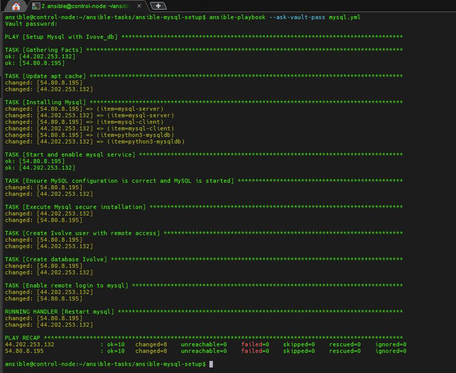
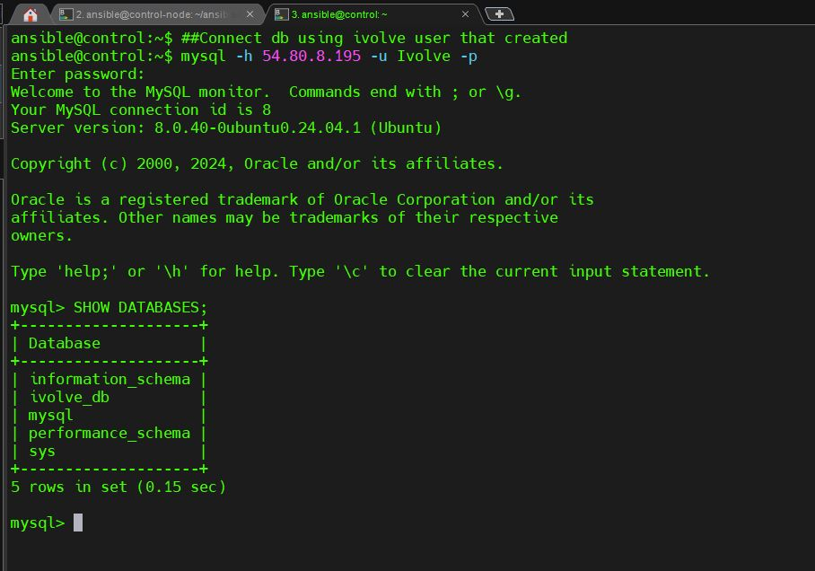

# MySQL Setup with Ivove_db

This Ansible playbook sets up MySQL with the Ivove_db database and configures remote access for the Ivove user. It also secures MySQL installation and ensures the MySQL service is properly configured and running.

## Prerequisites

- Ansible installed on the control node.
- MySQL should be available on the target nodes (Ubuntu or other supported OS).
- The target nodes should be added to the Ansible inventory.
- A `credentials.yml` file with the necessary MySQL credentials (`root_password`, `admin_user`, `admin_password`, `db_name`, `password_validation_policy`).

## Playbook Overview

### Tasks
1. **Update APT Cache**: Updates the APT package cache on the target nodes.
2. **Install MySQL Packages**: Installs `mysql-server`, `mysql-client`, and `python3-mysqldb`.
3. **Start and Enable MySQL Service**: Ensures that the MySQL service is started and enabled to start on boot.
4. **Ensure MySQL Configuration**: Ensures the MySQL configuration allows the `skip-grant-tables` option.
5. **Execute MySQL Secure Installation**: Runs the `mysql_secure_installation` script with predefined responses to secure the MySQL installation.
6. **Create Ivove User with Remote Access**: Creates a MySQL user with the specified credentials and grants full privileges for all databases.
7. **Create Database Ivove**: Creates a MySQL database named `Ivove_db`.
8. **Enable Remote MySQL Login**: Updates the MySQL configuration to allow remote connections by changing the `bind-address` to `0.0.0.0`.

### Handlers
- **Restart MySQL**: Restarts the MySQL service if any changes are made to its configuration files.

## Variables

This playbook requires the following variables, which should be defined in the `credentials.yml` file:

```yaml
root_password: "<root_password>"
admin_user: "<admin_user>"
admin_password: "<admin_password>"
db_name: "Ivove_db"
password_validation_policy: "<password_validation_policy_level>"
Running the Playbook
To run the playbook, execute the following command:

bash
Copy code
ansible-playbook -i inventory_file mysql_setup.yml
Replace inventory_file with your actual Ansible inventory file.

Notes
The playbook assumes that MySQL is installed on the target nodes and configures the service accordingly.
The mysql_secure_installation command is run non-interactively using the expect module.
The MySQL user is granted full privileges for all databases with remote access (%).
License
This project is licensed under the MIT License.

javascript
Copy code

You can save this as a `README.md` file in your repository to document the playbook and its usage.

```
## Apply-Playbook Screenshot:
 	
	

## Verfiy all set-up mysql 

        
