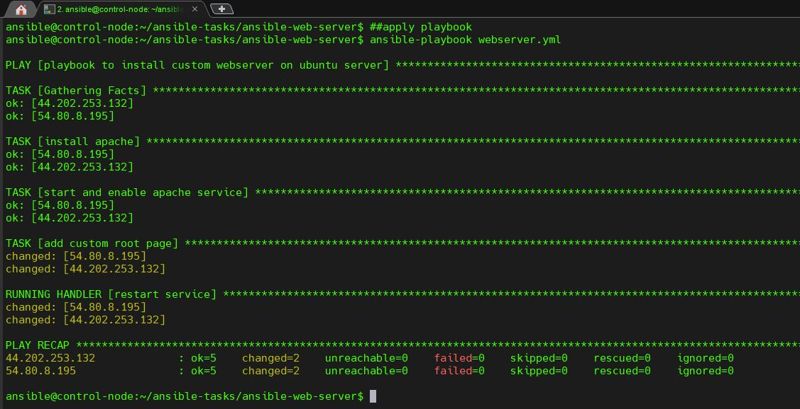
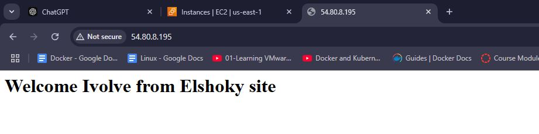
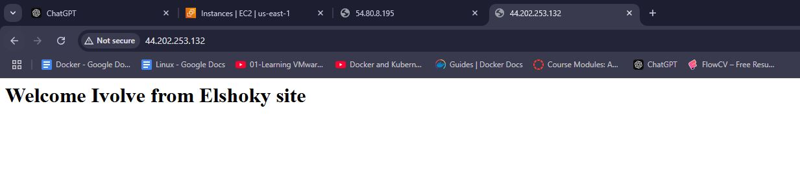

# Ansible Playbook for Web Server Configuration

This Ansible playbook automates the configuration of a web server.

## Prerequisites
* An Ansible control node
* Target web servers with SSH access
* Ansible installed on the control node

## Usage
1. **Inventory File:** Create an inventory file (e.g., `inventory`) to list your target web servers.
2. **Playbook:** Copy the provided `playbook.yml` file to your Ansible project directory.
3. **Templates:** Create template files for configuration files (e.g., `templates/index.html.j2`).
4. **Run the Playbook:** Execute the playbook using the following command:

   ```bash
   ansible-playbook webserver.yml 
   ```
    

## Screenshots to verfiy webserver nodes configration:
    
    
    

**Remember to replace the placeholder image links with actual image URLs or embed the images directly into your README file using Markdown syntax.**


