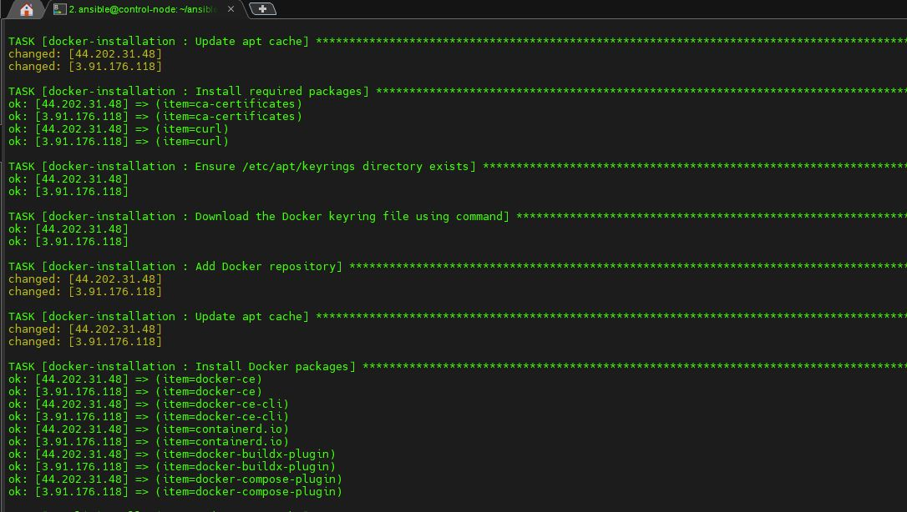
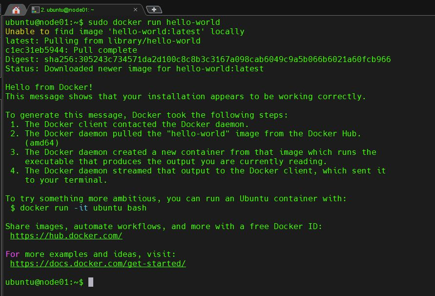

## Diagram of the Ansible Playbook Installation Process

<p align="center">
  
</p>


Role Name
=========

Docker Installation.

Requirements
------------

### Control Machine
- **Operating System**: Any OS with Ansible installed.
- **Ansible Version**: 2.9 or later.
- **Required Ansible Modules**:
  - `apt`
  - `ansible.builtin.file`
  - `ansible.builtin.get_url`
  - `shell`
  - `ansible.builtin.package`

### Target Machine
- **Operating System**: Ubuntu (any supported version for Docker installation).
- **Privileges**: A user with `sudo` privileges or equivalent permissions.

### Network Requirements
- Internet access to download:
  - Docker GPG keyring file.
  - Docker packages from `https://download.docker.com`.


Role Variables
--------------

## Role Variables

The following variables can be customized to configure the playbook as needed. Ensure they are defined in your inventory or passed during playbook execution.

### `packages`
A list of prerequisite packages required for Docker installation. Example:
```yaml
packages:
  - apt-transport-https
  - ca-certificates
  - curl
  - gnupg
  - lsb-release
```

Dependencies
------------


This playbook has the following dependencies that must be satisfied for successful execution:

### Ansible Collections
- **`ansible.builtin`**: The core Ansible modules used in the playbook, such as `apt`, `file`, `get_url`, and `package`. These modules are typically available with a standard Ansible installation.

### Target System Dependencies
- **Docker Installation**: This playbook requires the target machine to have access to the Docker APT repository in order to download and install Docker-related packages.
- **Packages Required for Docker Setup**: The following packages must be installed on the target system:
  - `apt-transport-https`: Needed to handle `https` repositories.
  - `ca-certificates`: Used for validating SSL certificates.
  - `curl`: Required for downloading files and interacting with URLs.
  - `gnupg`: Used for handling GPG keys.
  - `lsb-release`: Needed to fetch system information, particularly the Ubuntu version.

### Python Requirements
- **Python 3.x**: Python 3 must be installed and set as the default Python interpreter on the target server. This is required for running the Ansible playbook and managing packages.

### Network Requirements
- **Internet Access**: The target machine must have internet access to:
  - Download Docker-related packages from `https://download.docker.com`.
  - Download the Docker GPG key for package verification.

These dependencies ensure that the playbook can successfully install Docker and its components on the target system.


ScreenShots
----------------

		       
       
        


License
-------

BSD

Author Information
------------------

An optional section for the role authors to include contact information, or a website (HTML is not allowed).
