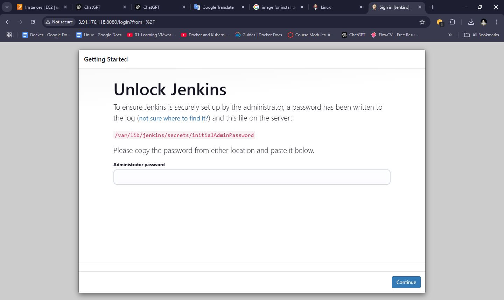

## Diagram of the Ansible Playbook Installation Process

  

Role Name
=========

Jenkins Installation.

Requirements
------------

Ansible Installed:

Ensure Ansible is installed on the control node.
Use a version compatible with the apt and lineinfile modules.
Target Node Configuration:

The target machine should:
Run a Debian-based Linux distribution (e.g., Ubuntu).
Have SSH access configured for Ansible.
Have sudo privileges to execute administrative tasks.

Role Variables
--------------

Purpose: Defines a list of required software packages that need to be installed on the target system before setting up Jenkins.

Dependencies
------------

1. System-Level Dependencies
These are the software or configurations that must be present on the target system for Jenkins to run smoothly:

Java Development Kit (JDK):

Jenkins requires a Java Runtime Environment (JRE) to function.
The playbook uses the openjdk-11-jdk package as a dependency, but any supported version of JDK can be used.
APT Package Manager:

The playbook assumes the target system uses apt (Debian/Ubuntu package manager) to manage software installations and upda

ScreenShots
----------------

License
-------

BSD

Author Information
------------------

An optional section for the role authors to include contact information, or a website (HTML is not allowed).
