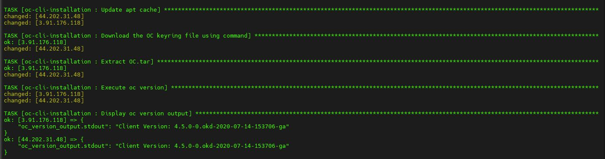

## Installing OpenShift CLI ‘OC’.

<p align="center">
  
</p>


Role Name
=========

This Ansible playbook automates the process of installing the OpenShift CLI (`oc`) on an Ubuntu-based system. The playbook simplifies the steps needed to download, install, and verify the installation of the OpenShift client, a command-line tool for interacting with OpenShift clusters.

### Key Features:
- **APT Cache Update**: Ensures the system's package information is up-to-date.
- **Download OpenShift CLI**: Downloads the OpenShift client (`oc`) from the official GitHub release.
- **Extract and Install**: Extracts the downloaded tar file to the appropriate system directory (`/usr/local/bin/`).
- **Version Verification**: Executes the `oc version` command to confirm the installation and version of the CLI.
- **Output Display**: Prints the output of the `oc version` command for verification.

This playbook is ideal for automating the installation of OpenShift tools across multiple servers or environments, providing a consistent and reliable method for getting started with OpenShift cluster management.

Requirements
------------

### Control Machine
- **Operating System**: Any system with Ansible installed.
- **Ansible Version**: 2.9 or later.
- **Required Ansible Modules**:
  - `ansible.builtin.apt`
  - `ansible.builtin.get_url`
  - `ansible.builtin.unarchive`
  - `ansible.builtin.shell`
  - `ansible.builtin.debug`

### Target Machine
- **Operating System**: Ubuntu (or any compatible Linux distribution).
- **User Privileges**: The user running the playbook must have `sudo` privileges to install packages and extract files to `/usr/local/bin/`.
- **Python**: Python 3.x should be installed on the target machine for Ansible to function correctly.
  
### Network Requirements
- **Internet Access**: The target machine must have access to the internet in order to download the OpenShift CLI binary from GitHub and retrieve the necessary files for installation.

### Packages
- The target system must have the following packages installed:
  - **`curl`**: Required to download files from URLs.
  - **`tar`**: Required to extract the `.tar.gz` file.
  - **`unzip`**: Required for extracting certain archive types (if needed in future versions of the playbook).

---

These requirements ensure that the playbook runs smoothly and successfully installs OpenShift CLI (`oc`) on your Ubuntu server.


Role Variables
--------------

This playbook does not require any mandatory custom variables. However, the following variables can be adjusted as per your requirements:

### `dest`
- **Description**: Specifies the destination path where the downloaded file will be saved.
- **Default**: `/home/ubuntu`
- **Example**:
  ```yaml
  dest: /home/your-user

  ```
Dependencies
------------


This playbook has the following dependencies:

### Ansible Modules
- **`ansible.builtin.apt`**: Used to update the APT cache and install packages if needed (although not explicitly required for this playbook, the module is used for cache updates).
- **`ansible.builtin.get_url`**: Downloads the OpenShift CLI tar file from the GitHub release URL.
- **`ansible.builtin.unarchive`**: Extracts the downloaded tar file into the target directory (`/usr/local/bin/`).
- **`ansible.builtin.shell`**: Executes shell commands, specifically used to run the `oc version` command to verify the OpenShift CLI installation.
- **`ansible.builtin.debug`**: Displays the output of the `oc version` command to confirm successful installation.

### External Dependencies
- **OpenShift CLI**: The playbook fetches the OpenShift CLI from the official GitHub release link, ensuring the correct version is used for the installation.
  - The CLI is available for download at: [OpenShift CLI GitHub Releases](https://github.com/openshift/okd/releases).
  
- **Tar Utility**: The target machine must have the `tar` utility installed to extract the `.tar.gz` file containing the OpenShift CLI binary.

### Optional
- If you modify the playbook to download or extract additional tools, ensure that the relevant utilities (e.g., `wget`, `unzip`) are installed on the target machine.

This playbook has minimal external dependencies and works seamlessly on a fresh Ubuntu setup with Ansible installed.


ScreenShots
----------------





License
-------

BSD

Author Information
------------------

An optional section for the role authors to include contact information, or a website (HTML is not allowed).
