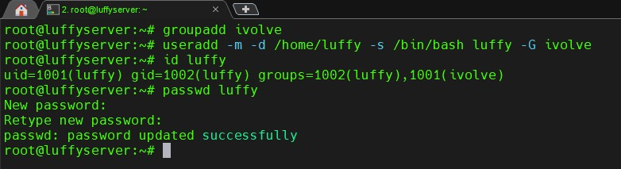
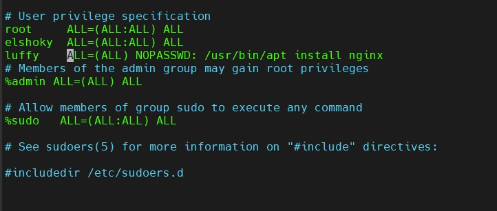
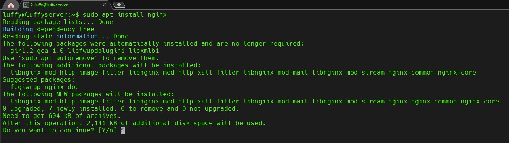
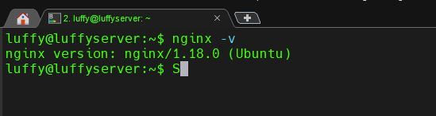
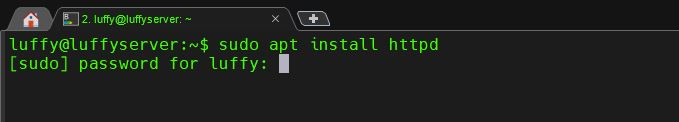

# Create Group, User, Assign Permissions, and Install Nginx

This guide explains how to:

1. Create a new group called `ivolve`.
2. Create a new user named `luffy` and assign the user to the `ivolve` group.
    
3. Grant the user `luffy` the necessary permissions to install Nginx with elevated privileges, without requiring a password.
    
4. Install Nginx using the `luffy` user.
    
5. Verify the Nginx installation.
 
   
6. Test the ability to install `httpd` (verify the sudo permission restriction).
        


---

## Prerequisites

Before starting, ensure that:

- You have root or sudo privileges on the machine.
- You have terminal or SSH access to the system.

---

## Steps : User and Group Management

To begin, create a new group named `ivolve`. This group will be used to assign the user `luffy`.

```bash
# Create the 'ivolve' group
groupadd ivolve

# Create the user 'luffy' and add them to the 'ivolve' group
useradd -m -G ivolve luffy

# Set a password for the user 'luffy'
passwd luffy
visudo
luffy ALL=(ALL) NOPASSWD: /usr/bin/apt-get install nginx
su - luffy
apt-get update
apt-get install nginx
