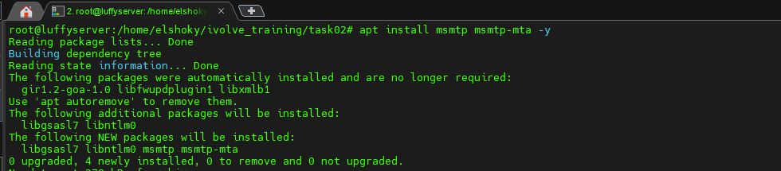
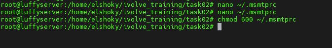
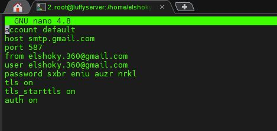
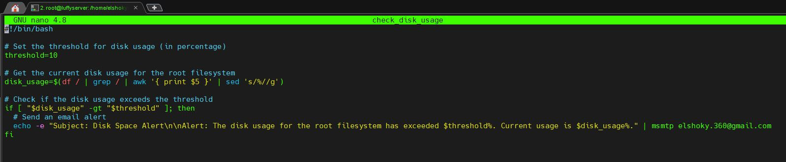
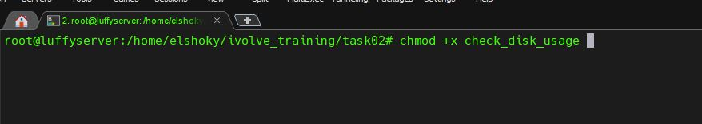
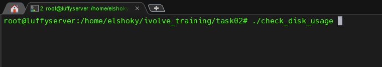
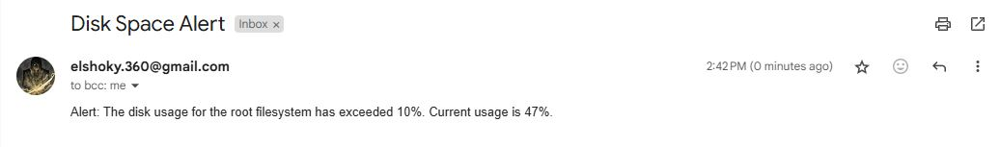
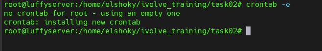
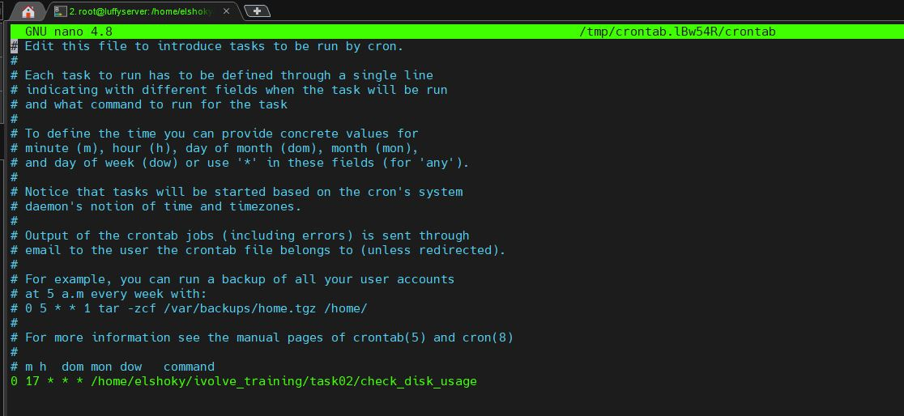

# Disk Space Monitoring Script

This repository contains a script to monitor the disk usage of the root filesystem (`/`). If the disk usage exceeds a specified threshold (90% by default), it sends an email alert to a configured address. You can customize the script to adjust the threshold and the email recipient.

---

## Features

- Monitors the disk usage of the root filesystem (`/`).
- Sends email alerts if disk usage exceeds the defined threshold (default is 90%).
- Customizable email recipient and alert threshold.
- Easy to configure and extend.

---

## Prerequisites

Before running the script, ensure:

1. Your system is connected to the internet and has a working SMTP client (`msmtp`) installed.
2. **msmtp** and **msmtp-mta** are installed for sending emails.
---
## Steps 
### Step 1: Install required packegs


### Step 2: Do it for Security


### Step 3: Configure msmtp


### Step 4: Create Script


### Step 5: Make it Executable


### Step 6: Run Script


### Step 7: Cheching The Alert that Send to email


### Step 8: Schedule By crontab


### Step 9: Syntax cron



To install the required packages, run:

```bash
sudo apt update
sudo apt install msmtp msmtp-mta

```bash
sudo apt update
sudo apt install msmtp msmtp-mta

### 2.  Create the Disk Usage Check Script

nano ~/check_disk_usage.sh

chmod +x ~/check_disk_usage.sh

### 4. Schedule the Script with Cron

crontab -e
0 17 * * * /home/elshoky/Ivolve_training/task02/check_disk_usage

### 5. How It Works

The script checks the disk usage of the root filesystem (/).
If the disk usage exceeds 90%, the script sends an email to the configured address (elshoky.360@gmail.com) using msmtp.
You can modify the threshold in the script if you want a different alert threshold

### 6. Customization

Email Address: Change the email address in the script to receive alerts at a different address.
Threshold: You can change the threshold percentage to a value of your choice (e.g., 80% or 95%).


### Final Steps
- Save the file by pressing `Ctrl + O`, then exit with `Ctrl + X`.
- The README provides a complete guide to set up, configure, and use the disk space alert script.

Let me know if you need any further edits or details!

