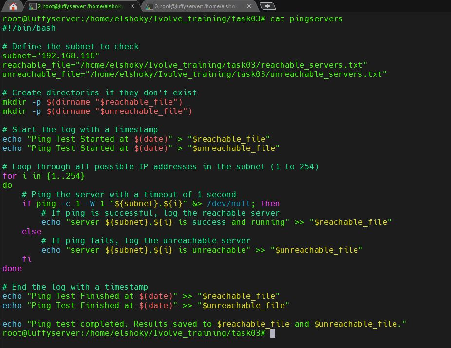
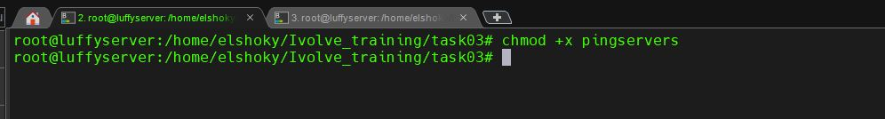
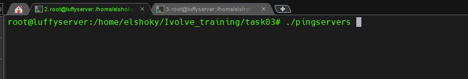
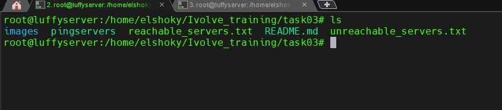
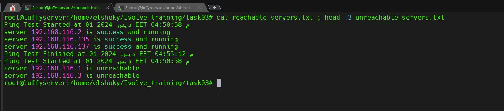

# Ping Server Script

This repository contains a Bash script to check the availability of servers within a specified subnet (`192.168.116.x`, where `x` ranges from 1 to 254). The script pings each server in the subnet and logs the results into two separate files:

- **`reachable_servers.txt`**: Servers that responded successfully to the ping.
- **`unreachable_servers.txt`**: Servers that did not respond to the ping.

---

## Features

- Pings all IP addresses in the subnet `192.168.116.x`.
- Saves results to `reachable_servers.txt` and `unreachable_servers.txt`.
- Automatically creates required directories and files if they do not exist.
- Easy to execute and extend.

---

## Prerequisites

Before running the script, ensure:

1. Your system is connected to the `192.168.116.0/24` network.
2. Bash is installed (default on Ubuntu).
3. Proper permissions to create and write files in the target directory.

---
## Steps to Use the Script
### Step 1: Create the `ping_server` Script


### Step 2: Make Executable the `ping_server` Script


### Step 3: Run the `ping_server` Script


### Step 4: List Files


### Step 5: Checking



## How to Use

### 1. Clone the Repository
```bash
git clone https://github.com/elshoky/Ivolve_Training.git
cd Ivolve_Training/task03
2. Make the Script Executable
bash
Copy code
chmod +x ping_servers.sh
3. Run the Script
Execute the script to start the pinging process:

bash
Copy code
./ping_servers.sh
4. View the Results
The script outputs results to:

reachable_servers.txt: Lists reachable servers.
unreachable_servers.txt: Lists unreachable servers.
To check the results:

bash
Copy code
cat ~/Ivolve_training/task03/reachable_servers.txt
cat ~/Ivolve_training/task03/unreachable_servers.txt
Files in This Repository
ping_servers.sh: The main Bash script for server availability testing.
README.md: Documentation for the script.
images/: Example screenshots showing the script in action.
Example Outputs
Script in Directory


Making the Script Executable


Running the Script

Result Files
Listing Files

Viewing Results

Notes
If the directory ~/Ivolve_training/task03/ does not exist, the script will create it automatically.
To schedule this script to run automatically, consider using a cron job.
Contributing
Feel free to fork this repository, submit issues, or create pull requests to contribute.

License
This project is licensed under the MIT License. See the LICENSE file for details.

vbnet
Copy code

You can save this directly as `README.md` and upload it to your GitHub repository. Let me know if you need help with additional formatting or edits!


