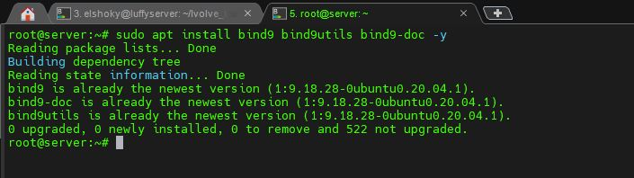
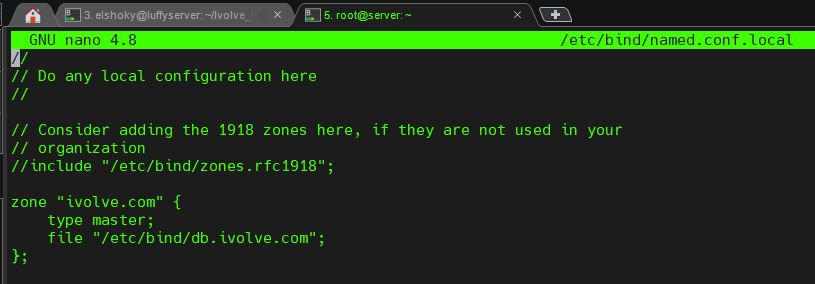
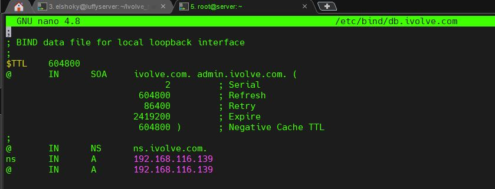
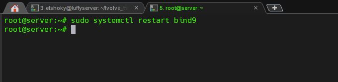
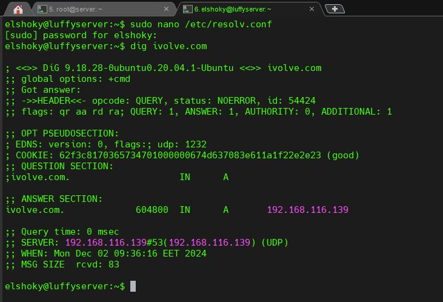

# BIND9 Configuration for DNS Resolution

## Objective
Set up and configure BIND9 as a DNS server to resolve a domain (`ivolve.com`) and its wildcard subdomains to a specific IP address (`192.168.116.137`).

---

## Prerequisites
- A Linux system (e.g., Ubuntu) with administrative (sudo) access.
- BIND9 and its utilities installed.
- Basic knowledge of DNS concepts.

---

## Steps

### 1. Install BIND9
To install BIND9 and related tools:

sudo apt update
sudo apt install bind9 bind9utils bind9-doc -y

### 2. Create Zone and Type of Master
sudo nano /etc/bind/named.conf.local

### 3. Create Dns zone file
sudo cp /etc/bind/db.local /etc/bind/db.ivolve.com
sudo nano /etc/bind/db.ivolve.com

### 4. Restart bind9.service
sudo systemctl restart bind9

### 5. Test DNS Resolution
sudo nano /etc/resolv.conf
nameserver 192.168.116.139
dig ivolve.com

