# Disk Management and Logical Volume Setup

This guide provides step-by-step instructions for attaching and managing a 15GB disk in a Linux virtual machine, partitioning it, and configuring its sections as specified.

## Objective

- Attach a 20GB disk to the VM.
- Partition it into the following sections:
  - **5GB** for a file system.
  - **5GB** for a Volume Group (VG) with a Logical Volume (LV).
  - **3GB** to extend the Logical Volume.
  - **2GB** as swap space.
- Configure and use the partitions as described.

---

## Steps

### **1. Attach a 15GB Disk to the VM**

- Access the virtualization platform (e.g., VirtualBox, VMware, or cloud service).
- Add a new **15GB** disk to the virtual machine.

### **2. Identify the New Disk**

 Log in to the VM:
   
   ssh user@VM_IP

### **3. Create Two new Partition
Open the fdisk utility:
sudo fdisk /dev/sdb
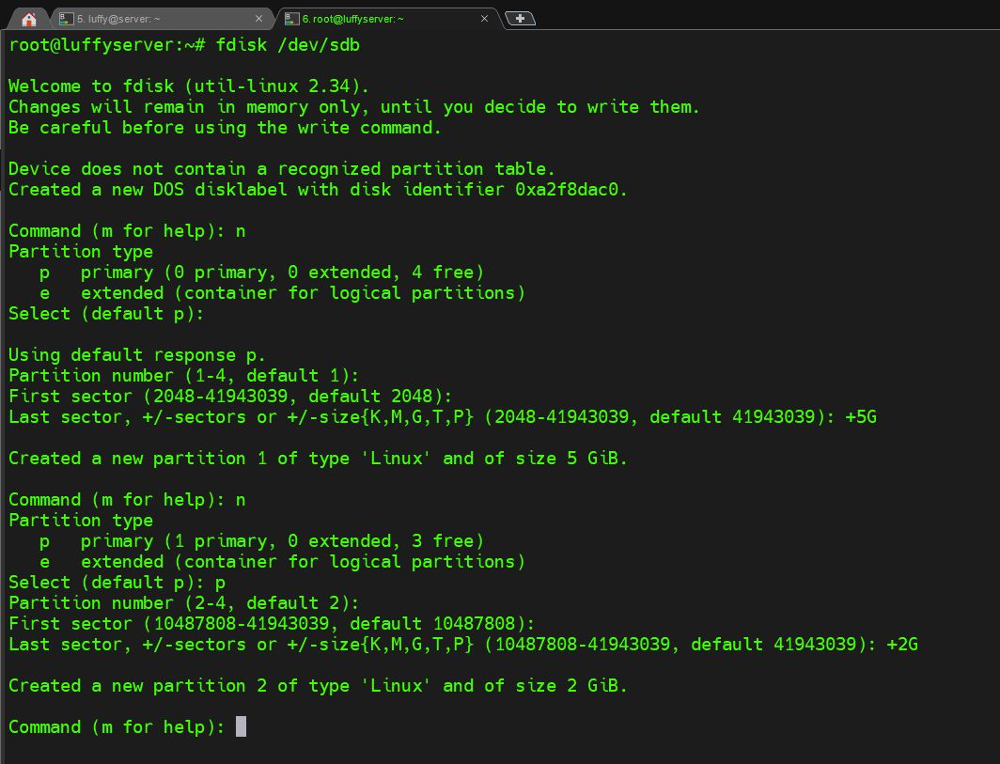

### **4. Specify Type for second Partition to be Swap
Open the fdisk utility:
sudo fdisk /dev/sdb
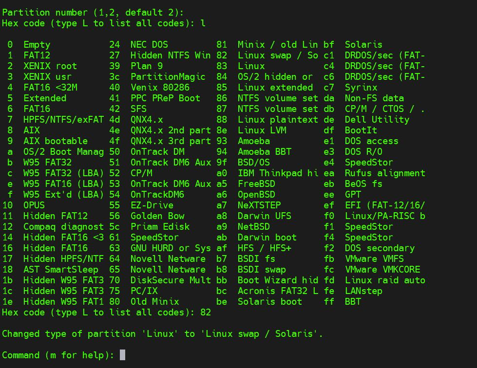

### **5. Create and Specify Type for last two partition to be lvm
Open the fdisk utility:
sudo fdisk /dev/sdb
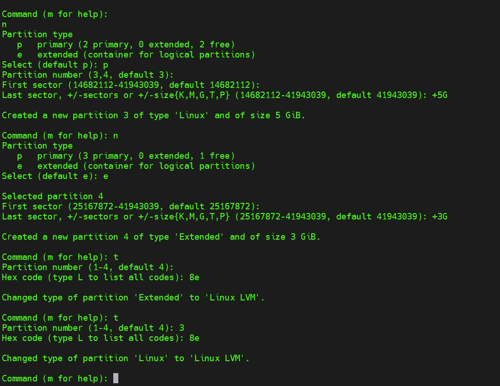

### **6. Checking of Creating Partitions

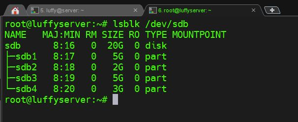

### **7. Make file system & type of ext4 for standard partiton

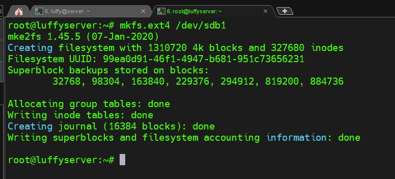

### **8. Mount Partion

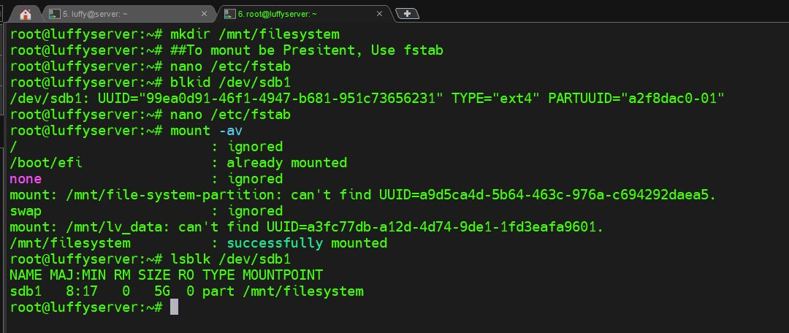

### **9. Configure Fstab file

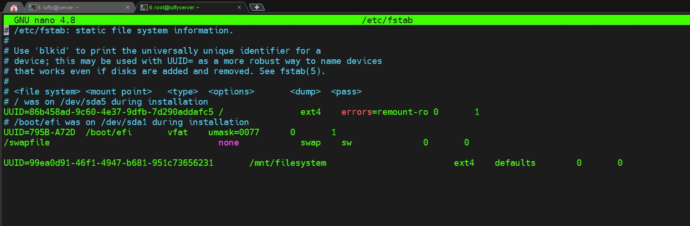

### **10. mkswap swap partition

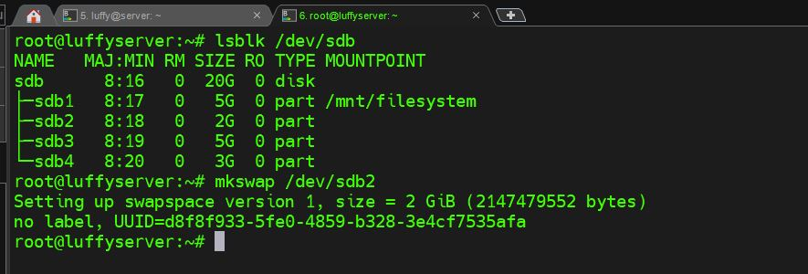

### **11. Make Swap Presistent in fstab

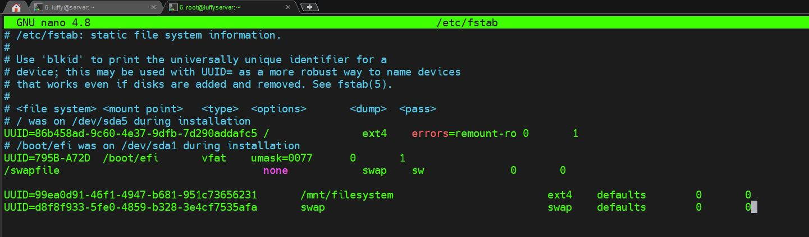

### **12. make system read configraton from fstab

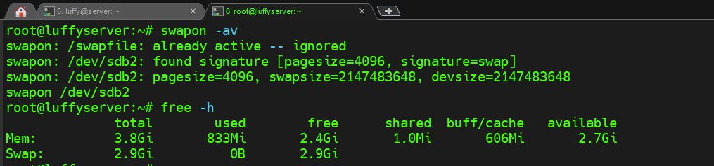

### **13. Create Physical-Volume & Create Volume-Group & Create Logical-Volume

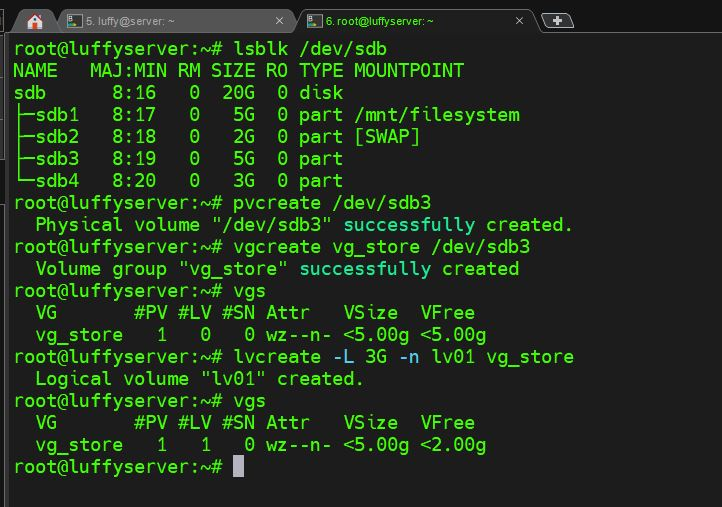

### **14. Make format by ext4 for logical volume & Presistent Mount

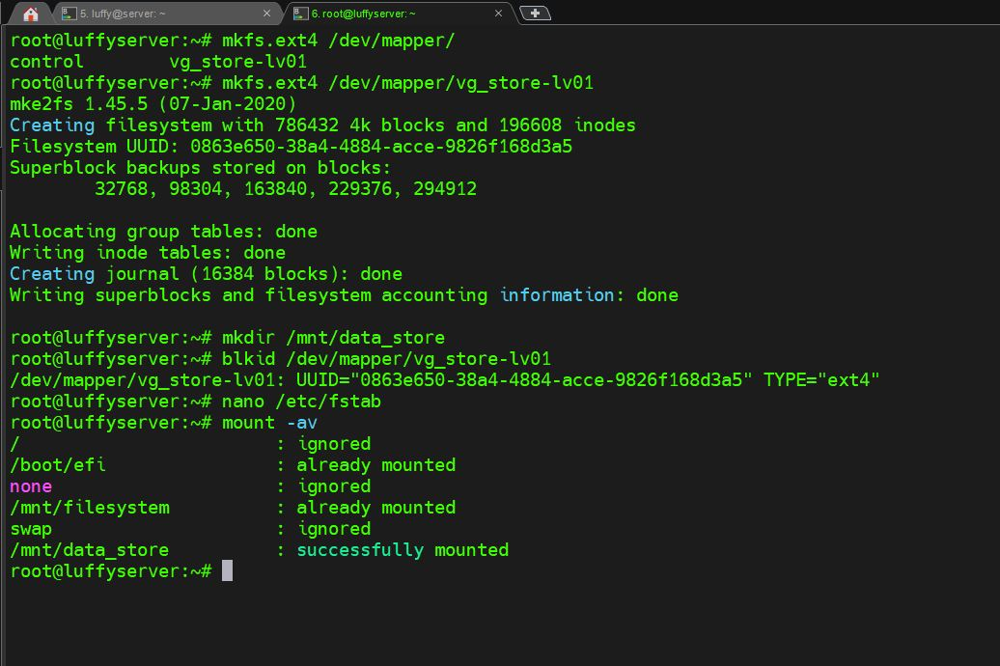

### **15. Extended Logical Volume 

### **16. Check all what have Done!

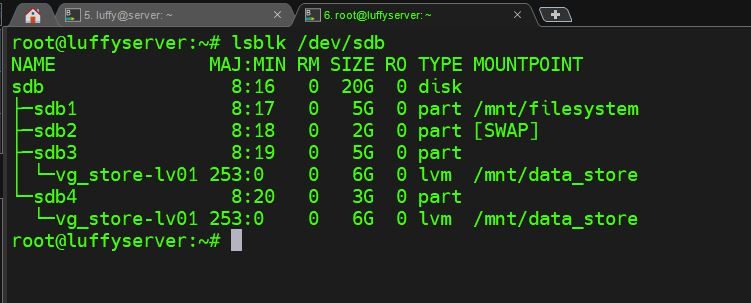
		---

### ** By following this guide, you have successfully configured the disk with partitions, swap space, and logical volumes on your Linux VM.

