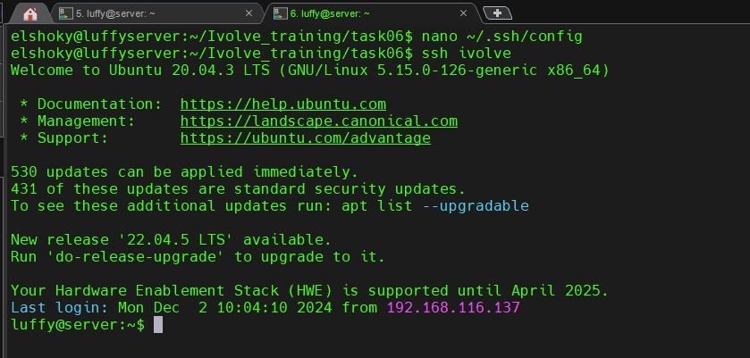
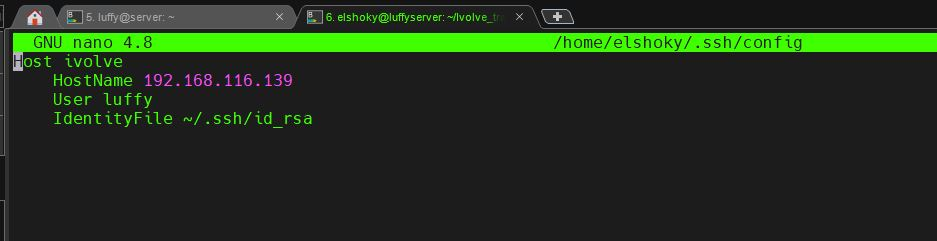

# **Lab 6: SSH Configurations**

## **Objective**  
This lab demonstrates how to generate SSH keys, configure key-based SSH authentication, and set up a simplified SSH connection using a custom alias.

---

## **Steps**

### 1. **Generate SSH Keys**  
Run the following command to generate a public-private key pair:
```bash
ssh-keygen -t rsa -b 2048 



### 2. **Create or edit the SSH configuration file on your local machine**



### 3. **Test Simplified SSH Command**
```bash
ssh ivolve


